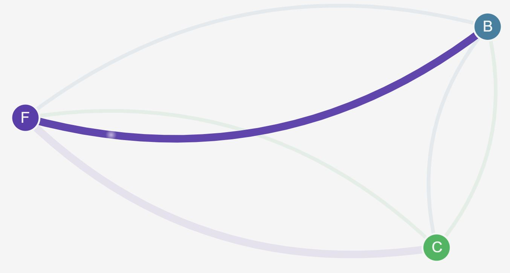
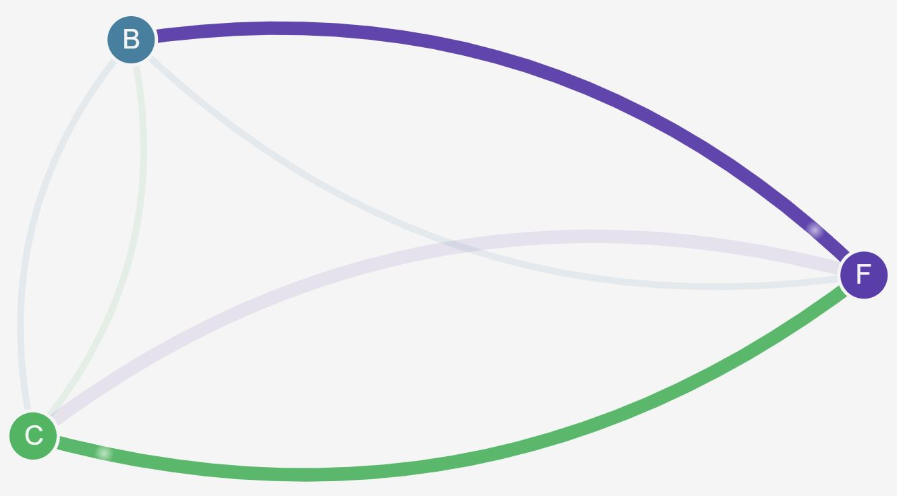
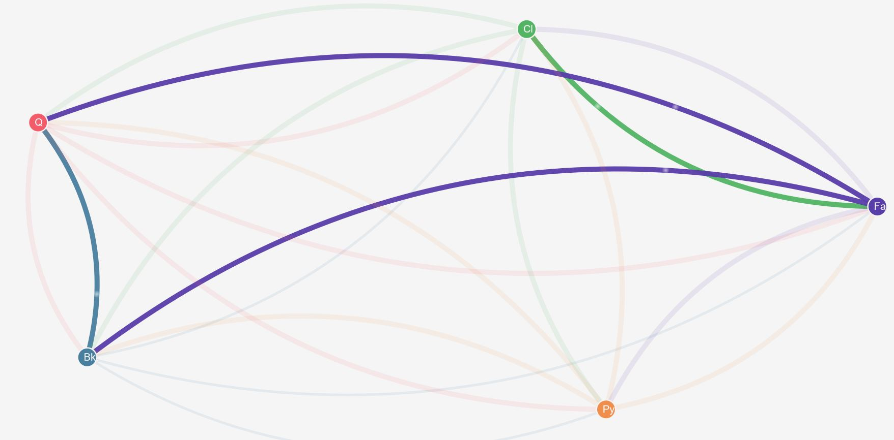

## Demo app - no policies:

Deploy stack:
```
kubectl apply -f ./manifests/
```


## Ingress policies:

Deny all ingress for app namespaces:

```
kubectl apply -f ./policies/ingress/default-deny.yaml
```

> No nodes in graph

Allow ingress from management UI to app namespaces:

```
kubectl apply -f ./policies/ingress/allow-management-ui.yaml
```


Allow backend to access frontend:

```
kubectl apply -f ./policies/ingress/backend-policy.yaml
```



Allow client to access frontend:

```
kubectl apply -f ./policies/ingress/frontend-policy.yaml
```



## Egress policies:

Deny all egress from PCI namespace:

```
kubectl apply -f .\policies\egress\pci-policy.yaml
```

Add the payments service and the queue to the management UI:

```
curl -X POST \
  http://ip172-18-0-5-bc0r9r8qitt0008vn9j0.direct.beta-hybrid.play-with-docker.com:33002/resources \  
  -H 'Content-Type: application/json' \
  -d '{
	"id": "P",
	"url": "http://payments.pci:6380/status"
}'

curl -X POST \
  http://ip172-18-0-5-bc0r9r8qitt0008vn9j0.direct.beta-hybrid.play-with-docker.com:33002/resources \  
  -H 'Content-Type: application/json' \
  -d '{
	"id": "Q",
	"url": "http://queue.infrastructure:5000/status"
}'
```



Allow the backend to publish messages to the queue:

```
kubectl apply -f .\policies\ingress\queue-policy.yaml
```

Then allow Payments service to publish messages

```
kubectl apply -f .\policies\egress\payments-policy.yaml
```
