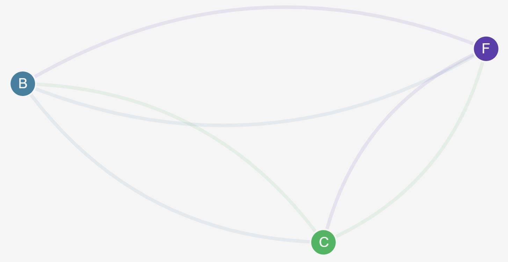
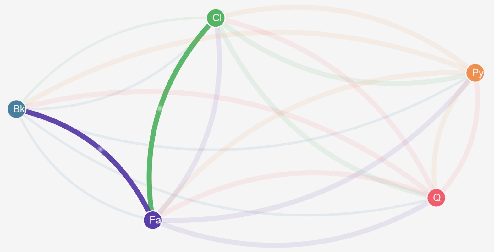

# Kubernetes Networking in Docker EE

Docker EE supports Kubernetes and Docker Swarm running on the same cluster. Networking in Kubernetes has similar features to Docker Swarm - containers in pods an reach each other by DNS name, and Kubernetes can load-balance incoming requests across pods.

Kubernetes has one useful networking feature which Docker Swarm does not have - networking policies. Policies let you restrict traffic between containers in a way which is transparent to the application inside the container. In this section you'll learn how to use networking policies.

## Controlling Network access

Docker EE uses [Calico](https://www.projectcalico.org/) for networking in Kubernetes - it's all configured for you when you deploy a Docker EE cluster. Calico implements Kubernete's [NetworkPolicy](https://kubernetes.io/docs/concepts/services-networking/network-policies/) resources, allowing you to configure `ingress` and `egress` rules for pod traffic:

- `ingress` policies define which network sources are allowed to send traffic into a pod. These are useful for restricting service access to specific consumers;
- `egress` policies define which network targets a pod is allowed to send traffic to. These are useful for isolating services so they can only connect to specific components, and for blocking traffic leaving the cluster to external Internet addresses.

## The Demo App

The demo for this part of the workshop is a distributed application with multiple components. Version 1 of the app has a legacy backend service, which is fronted by a facade. There's a client application which talks to the facade to use backend services:

==TODO - diagram==

Version 2 of the app introduces a payment service. The service isn't directly accessible - only via a queue. Backend services can publish request messages to the queue, and the payments service can process them and publish response messages to the queue:

==TODO - diagram==

> The app has been badly configured though, so every service is trying to use every other service. We'll use network policies enforced by Calico to make sure traffic flows where it should.

## Deploy the Demo App

You can use `kubectl` to manage Kubernetes on Docker EE, as well as using UCP. Start by cloning the GitHub repo for the demo app - connect to the **manager1** node, and setup kubectl to use the client bundle to authenticate with UCP.

```
 password='<password credential>'
 controller='<ucp hostname>'
 AUTHTOKEN=$(curl -sk -d '{"username":"admin","password":"'$password'"}' https://$controller/auth/login | jq -r .auth_token)
curl -sk -H "Authorization: Bearer $AUTHTOKEN" https://$controller/api/clientbundle -o bundle.zip
unzip bundle.zip
eval "$(<env.sh)"
```

Next clone the repo and navigate to the `kubernetes` directory:

```
git clone https://github.com/sixeyed/docker-networking-workshop.git
cd ./docker-networking-workshop/kubernetes
```

Now deploy version 1 of the application:

```
kubectl apply -f ./manifests/
```

> Browse to UCP and check out the Load Balancers in the Kubernetes `management-ui` namespace. From there you can browse to the management UI for the app, which shows where traffic is flowing:


This isn't good. The frontend is communicating directly with the backend, as well as with the facade, and the facade and backend are communicating with the frontend. We can fix that with ingress policies.

## Ingress Policies

To start with you'll deploy a blanket ingress policy which restricts all traffic to all pods. When this is enforced, pods will only be able to communicate if they have an ingress policy which specifies explicit access, overriding the default policy.

Deny all ingress for app namespaces by deploying [default-deny.yaml](kubernetes/policies/ingress/default-deny.yaml), which sets up a network policy in each namespace with these rules:

- for any pod in the namspace
- restrict ingress traffic to an empty list - i.e. allow no ingress traffic

```
kubectl apply -f ./policies/ingress/default-deny.yaml
```

> Refresh your management UI and after a few seconds you'll see a blank screen. The UI component can't even access the application pods to see where traffic is flowing!

The first thing is to allow ingress traffic from the management UI, so you can see what's happening. [allow-management-ui.yaml](kubernetes/policies/ingress/allow-management-ui.yaml) sets up a policy in each namespace with these rules:

- for any pod in the namspace
- allow ingress traffic from any pod in a namespace which matches the label `role=management-ui`

Deploy the policy to set up the UI:

```
kubectl apply -f ./policies/ingress/allow-management-ui.yaml
```

> Note that the YAML file applies the same network policy to all the application namespaces.

Now in the management UI you can see all the app components, but they're still isolated so there's no traffic between them:



We'll set up the correct access by applying new ingress rules, specifying where we want traffic to go. [backend-policy.yaml](kubernetes/policies/ingress/backend-policy.yaml) has rules to allow the facade to access the backend:

- in the namespace `backend`
- for any pods matching the label `app=backend`

```
kubectl apply -f ./policies/ingress/backend-policy.yaml
```

Refresh the management UI and you'll see traffic is no flowing from the facade to the backend, but the client is still isolated:


Next [facade-policy.yaml](kubernetes/policies/ingress/facade-policy.yaml) allows the client to access the facade:

```
kubectl apply -f ./policies/ingress/facade-policy.yaml
```

In the management UI you'll see that traffic is now flowing where we want it to go, and we are enforcing the correct data flow at the orchestration layer:


> It's important to realise that these are the same pods you deployed at the start, and they are still *trying* to send traffic everywhere. The application hasn't been fixed, but the traffic is under control with ingress policies.

## Egress Policies

Version 2 of the app deploys the payment service running in the `pci` namespace, and the message queue running in the `infrastructure` namespace.

Deploy new version of the management UI and you'll see those components in the stack:

```
kubectl apply -f ./management-ui-v2.yaml
```

The queue and payments service are isolated because of the default ingress policies, blocking all non-whitelisted traffic:



We want some extra security around the payments service, because it needs PCI compliance. You can add a default egress policy which denies any non-whitelisted traffic.

[pci-policy.yaml](kubernetes/policies/egress/pci-policy.yaml) enforces these rules:

- for any pods in the `pci` namespace
- block all `egress` traffic to any destination
- except on port `53`, which is explicitly permitted.

Apply that policy and you'll see the management UI doesn't change, because the payments service is already isolated by ingress rules:

```
kubectl apply -f .\policies\egress\pci-policy.yaml
```

> You typically need to allow egress traffic on port 53 for DNS - without that, pods cannot resolve DNS names to enforce other policies.

Now you can add an ingress policy which explicitly allows traffic to the queue. [queue-policy.yaml](kubernetes/policies/ingress/queue-policy.yaml) does this:

- in the namespace `infrastructure`
- for pods matching the label `app=queue`
- allow ingress on TCP port 5000
- from any pod in a namespace matching the label `requires=queue`

Both the `pci` and `backend` namespaces specify that label, so when you deploy the policy it will allow apps to publish messages to the queue:

```
kubectl apply -f .\policies\ingress\queue-policy.yaml
```
This works for the `backend` and `facade` services, which can now publish messages. The `payments` service still can't send traffic - the ingress rule for the target destination allows it, but the egress rule from the source blocks it:


The final step is to allow egress from the `payments` service to the queue. [payments-policy.yaml](kubernetes/policies/egress/payments-policy.yaml) allows this:

- in the `pci` namespace
- for pods matching the label `app=payments`
- allow egress on any port
- to any pod in a namespace matching the label `role=infrastructure `

Deploy the final policy to complete configuration of the app:

```
kubectl apply -f .\policies\egress\payments-policy.yaml
```

Now all the traffic is flowing as required, controlled by network policies:


The default ingress rules prevent the application services receiving traffic from any new services without being explicitly allowed.

The default egress rule prevents any app which requires PCI compliance from sending traffic to any destination except infrastructure pods.

## Clean Up

Delete all the app namspaces:

```
kubectl delete ns frontend
kubectl delete ns backend
kubectl delete ns pci
kubectl delete ns infrastructure
```
